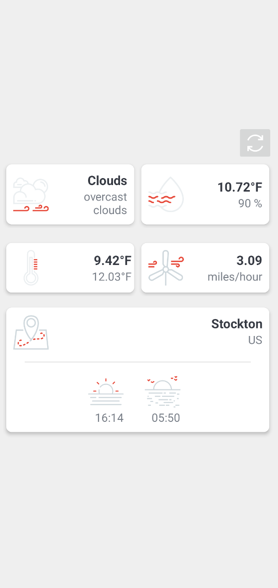

# WeatherApp

### A simple Android app that shows the current weather in your city using [OpenWeather API](https://openweathermap.org/api)

## Used technologies and tools

- Kotlin
- Android SDK
- Android XML
- Gson
- Retrofit
- [Dexter](https://github.com/Karumi/Dexter)

## Illustrations

### Home screen

